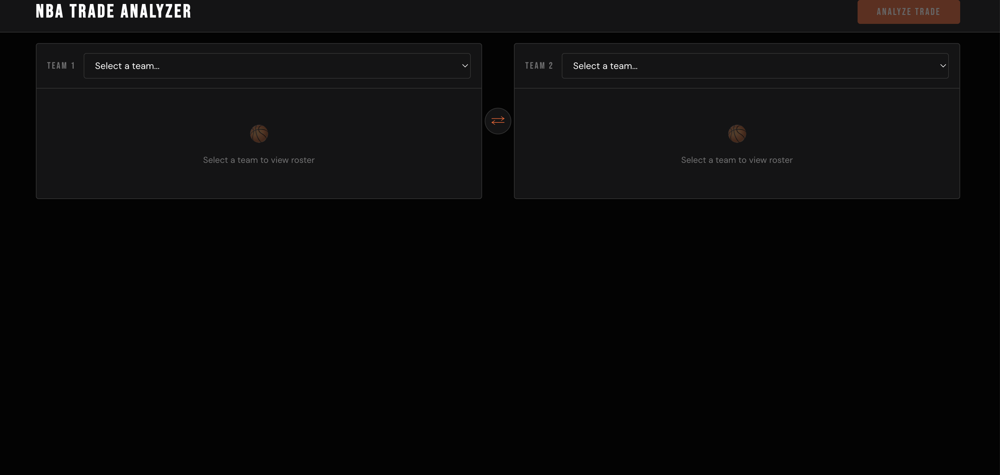
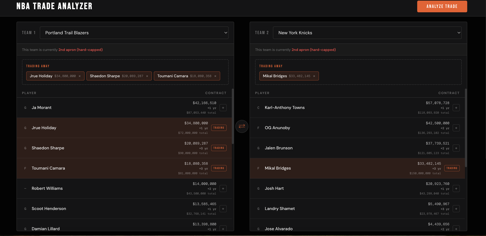
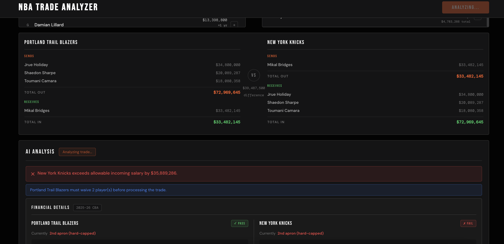
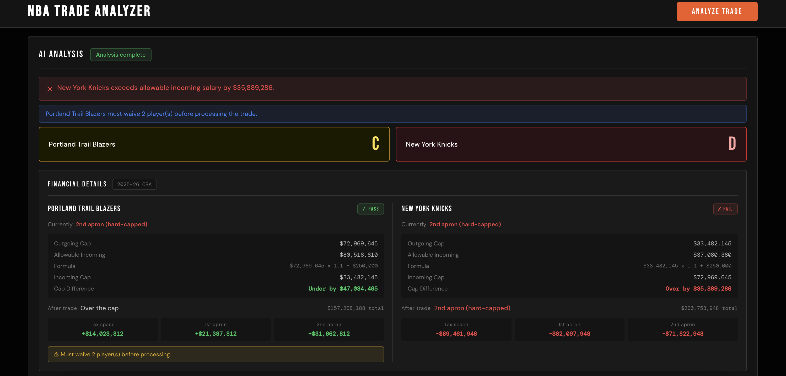
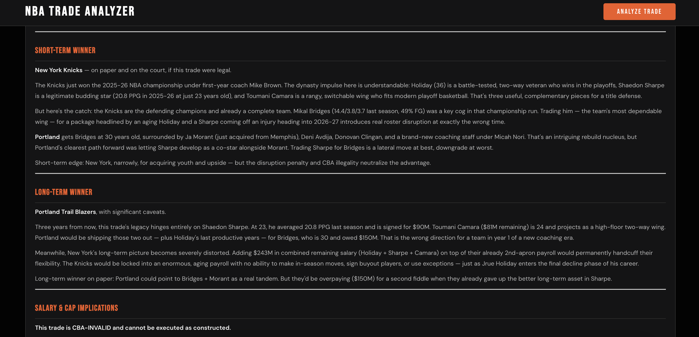
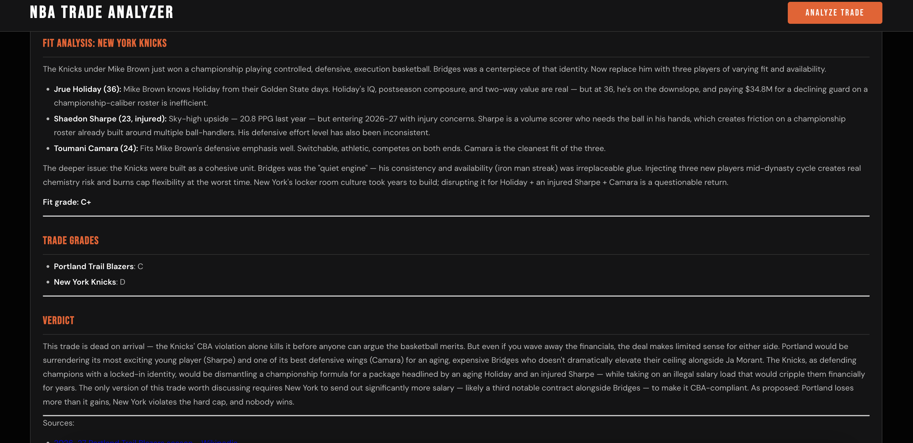

# NBA Trade Analyzer

A single-page web app for building hypothetical NBA trades and getting an instant, AI-generated breakdown of who wins, how the salary cap math works out, and how the incoming players fit each roster.

You pick two teams, mark which players each side is sending, and hit **Analyze**. The app pulls live rosters and current-season salaries, runs a CBA salary-matching legality check, builds a structured prompt, and streams a Claude-written analysis back to the browser word by word.

---

## Features

- **Two-team trade builder** — pick any two of the 30 NBA teams, select outgoing players per side; the incoming side is derived automatically.
- **Live roster + salary data** — rosters from the balldontlie API, current-season contracts scraped from HoopsHype, cross-referenced into an active roster.
- **CBA salary-matching engine** — computes each team's cap position (under-cap / over-cap / taxpayer / first apron / second apron) and checks whether the incoming salary is legal under the 2023 CBA matching rules.
- **Streaming AI analysis** — the response renders live as markdown with sections for short-term winner, long-term winner, cap implications, per-team fit, and a final verdict with letter grades.
- **No login, no database of user data** — it's a local tool; the only persistence is a MongoDB cache of team/player data.

---

## Screenshots

### 1. Start

Empty state — pick a team on each side to load its roster.

### 2. Build the trade

Each roster shows current salary, years left, and total contract value. Click players to move them into "Trading Away"; the badge flags each team's cap/apron status.

### 3. Trade summary and legality check

A live sends/receives breakdown with salary totals and the difference. On Analyze, the CBA salary-matching engine runs first — here it flags the Knicks as over their allowable incoming salary.

### 4. Financial detail

Per-team cap math: outgoing / allowable / incoming salary, the matching formula, post-trade cap status, and room to the tax line and both aprons. Pass/fail and a letter grade per side.

### 5. AI analysis

Claude's writeup streams in word by word — short-term winner, long-term winner, and cap implications, grounded in the legality numbers above.

### 6. Fit, grades, and verdict

Per-team fit analysis with a grade for each incoming player, overall trade grades, a final verdict, and source links.

---

## Architecture

Three independent Node processes:

```
[ Browser ]  React SPA (Vite, :3000)
     |  /api/*  (proxied by Vite)
     v
[ App Server ]  Express + MongoDB (:3001)
     |  - rosters + salaries (balldontlie API, HoopsHype scrape)
     |  - cap math + trade legality
     |  - prompt construction
     |  POST /invoke
     v
[ Claude Wrapper ]  Express (:3002)
     |  spawns: claude -p <prompt> --output-format stream-json --verbose
     v
  Claude Code CLI  (uses your local Anthropic auth)
```

| Service | Directory | Port | Responsibility |
|---|---|---|---|
| React client | `client/` | 3000 | UI, trade state, SSE rendering |
| App server | `server/` | 3001 | NBA data, cap/legality math, prompt building, SSE relay |
| Claude wrapper | `claude-wrapper/` | 3002 | Generic Claude CLI → SSE microservice (no NBA logic) |

Deeper technical notes live in `DESIGN.md` and the `AGENTS.md` file in each service directory.

---

## Tech stack

- **Frontend:** React 19, Vite, `react-markdown`, plain CSS variables (no UI framework)
- **Backend:** Node.js (ES modules), Express 4, Mongoose / MongoDB
- **AI:** Claude Code CLI, invoked as a subprocess and streamed as Server-Sent Events
- **External data:** [balldontlie API](https://www.balldontlie.io/) (free tier), HoopsHype salary pages (scraped)

---

## Prerequisites

- **Node.js 20+** (the app server uses the built-in `node --env-file`)
- **MongoDB** — a local `mongod` or a free MongoDB Atlas cluster
- **Claude Code CLI** — installed and authenticated (`claude` must be on your `PATH`; run `claude login` once)
- **A balldontlie API key** — free at <https://www.balldontlie.io/>

---

## Setup

Clone the repo, then install dependencies for each service:

```bash
git clone <your-repo-url>
cd nba-trade-analyzer

(cd claude-wrapper && npm install)
(cd server && npm install)
(cd client && npm install)
```

Create `server/.env`:

```
BALLDONTLIE_API_KEY=your_key_here
MONGODB_URI=mongodb://localhost:27017/nba-trade-analyzer
```

> The app server exits on startup if `MONGODB_URI` is not set or MongoDB is unreachable.

---

## Running

Start the three services in **separate terminals**, in this order:

```bash
# Terminal 1 — Claude wrapper (:3002)
cd claude-wrapper && node index.js

# Terminal 2 — App server (:3001)
cd server && node --env-file=.env index.js

# Terminal 3 — React client (:3000)
cd client && npm run dev
```

Then open <http://localhost:3000>.

### First run: populate the database

The app reads teams and rosters from MongoDB, which starts empty. With the app server running, trigger a full sync:

```bash
curl -N -H "Accept: text/event-stream" -X POST http://localhost:3001/api/sync
```

This fetches all 30 teams and their rosters and upserts them into MongoDB. Because the balldontlie free tier is capped at 5 requests/minute, a full sync is rate-limited and **takes roughly 30–60 minutes**. Progress streams back as SSE events. It only needs to be re-run when you want fresh roster/salary data.

---

## API reference (app server, `:3001`)

| Method | Path | Description |
|---|---|---|
| `GET` | `/api/teams` | All 30 current NBA teams |
| `GET` | `/api/teams/:id/players` | Active roster with salary and contract detail |
| `GET` | `/api/teams/:id/cap` | Team cap position and space to each threshold |
| `POST` | `/api/trade/evaluate` | CBA legality check for a trade (JSON, no AI) |
| `POST` | `/api/analyze` | Full trade analysis — SSE stream relaying the Claude response |
| `POST` | `/api/sync` | Full data sync from balldontlie + HoopsHype — SSE progress stream |

Request/response shapes are documented in `server/AGENTS.md`.

---

## Known limitations

- **No per-game stats.** The balldontlie free tier does not expose `season_averages`, so the prompt renders "Stats N/A" and the analysis leans on salary and player reputation.
- **HoopsHype is scraped, not an API.** Salary data depends on their page structure; if it changes, salaries fall back to `null` with no alerting.
- **Rate limits.** balldontlie free tier is 5 req/min. An in-memory cache mitigates normal use, but the initial sync is slow.
- **Local only.** No auth, no HTTPS, CORS open to all origins. Not intended for public deployment without hardening.
- **Cap thresholds are hardcoded per season** in `server/capThresholds.js` and must be updated each NBA season.

---

## Project structure

```
nba-trade-analyzer/
├── claude-wrapper/   # Generic Claude CLI → SSE HTTP microservice
├── server/           # NBA app server: data, cap math, legality, prompt, SSE relay
├── client/           # React + Vite single-page app
├── DESIGN.md         # Full architecture and design-decision write-up
└── BACKLOG.md        # Task backlog
```
